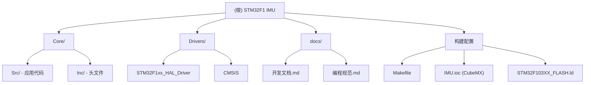

# STM32F1 IMU - 惯性测量单元项目

**项目类型**: 嵌入式 C (STM32F103 + MPU6050)
**最后更新**: 2025-10-21 18:37:25 CST
**开发阶段**: 活跃开发中
**许可证**: GPL-3.0

---

## 变更记录 (Changelog)

### 2025-10-21 - AI 上下文文档初始化
- 创建项目根级和模块级 CLAUDE.md 文档
- 建立 `.claude/index.json` 索引系统
- 覆盖率: 核心模块 100%, HAL驱动库 (仅引用，不详细分析)

---

## 项目愿景

本项目是一个基于 STM32F103RCT6 微控制器的惯性测量单元 (IMU) 项目，主要功能是通过 MPU6050 六轴传感器实现姿态检测和运动追踪。该项目是一个**YOLO云台追踪系统**的控制端，与 Jetson NX 视觉处理单元协同工作。

### 核心应用场景
- 智能云台自动跟踪目标
- 双轴舵机精确控制（俯仰/水平）
- 实时姿态融合与 PID 稳定控制
- CRSF 遥控器手动控制与失联保护

---

## 架构总览

### 系统架构

```
┌─────────────────────────────────────────────────────────┐
│            STM32F1 IMU 云台控制系统架构                  │
├─────────────────────────────────────────────────────────┤
│                                                         │
│  ┌──────────────┐         ┌──────────────┐            │
│  │  Jetson NX   │←─UART3─→│ STM32F103RCT6│            │
│  │  (视觉处理)   │ 921600  │  (运动控制)   │            │
│  └──────────────┘         └───────┬──────┘            │
│         ↑                         │                   │
│         │                    ┌────┴────┐              │
│    摄像头输入                 │         │               │
│                         TIM5-PWM  软I2C              │
│                         333Hz     PA11/12            │
│                              │         │              │
│                         ┌────▼────┐ ┌─▼──────┐       │
│                         │ 数字舵机 │ │ MPU6050│       │
│                         │ (2个)   │ │  IMU   │       │
│                         └─────────┘ └────────┘       │
│                                                       │
│  ┌──────────────┐         ┌──────────────┐           │
│  │ CRSF接收机    │←─UART2─→│ STM32(控制)  │           │
│  │ (遥控器)      │ 420000  │   保险机制    │           │
│  └──────────────┘         └──────────────┘           │
└─────────────────────────────────────────────────────────┘
```

### 软件架构分层

```
┌─────────────────────────────────────────────────┐
│          应用层 (Application Layer)              │
│  ┌──────────┐  ┌──────────┐  ┌──────────┐      │
│  │状态机管理 │  │ 控制模式 │  │  安全监控 │      │
│  └──────────┘  └──────────┘  └──────────┘      │
├─────────────────────────────────────────────────┤
│          算法层 (Algorithm Layer)                │
│  ┌──────────┐  ┌──────────┐  ┌──────────┐      │
│  │姿态融合   │  │ PID控制  │  │  轨迹规划 │      │
│  │(待实现)   │  │(待实现)   │  │ (待实现)  │      │
│  └──────────┘  └──────────┘  └──────────┘      │
├─────────────────────────────────────────────────┤
│          驱动层 (Driver Layer)                   │
│  ┌──────────┐  ┌──────────┐  ┌──────────┐      │
│  │IMU驱动   │  │舵机驱动   │  │  串口驱动 │      │
│  │(已完成✓) │  │(TIM5配置✓)│  │(HAL配置✓)│      │
│  └──────────┘  └──────────┘  └──────────┘      │
├─────────────────────────────────────────────────┤
│         硬件抽象层 (HAL Layer)                    │
│  STM32 HAL Library (STM32CubeMX生成)             │
└─────────────────────────────────────────────────┘
```

---

## 模块结构图



---

## 模块索引

| 模块路径 | 职责说明 | 状态 | 关键文件 |
|---------|---------|------|---------|
| **[Core/](./Core/CLAUDE.md)** | 应用核心代码（IMU驱动、主逻辑、外设初始化） | 活跃开发 | `main.c`, `imu.c`, `soft_i2c.c` |
| **[Drivers/](./Drivers/CLAUDE.md)** | STM32 HAL库和CMSIS（由STM32CubeMX生成） | 稳定引用 | HAL库源码和头文件 |
| **[docs/](./docs/CLAUDE.md)** | 项目文档（开发文档、编程规范） | 活跃维护 | `开发文档.md`, `编程规范.md` |
| **构建系统** | Makefile + 链接脚本 + CubeMX配置 | 已配置 | `Makefile`, `*.ld`, `*.ioc` |

---

## 运行与开发

### 硬件需求
- **MCU**: STM32F103RCT6 (Cortex-M3, 72MHz, 256KB Flash, 48KB RAM)
- **传感器**: MPU6050 (六轴 IMU)
- **调试工具**: ST-Link V2/V3
- **外设**:
  - 2 个数字舵机 (连接 TIM5_CH1/CH2)
  - UART 调试串口 (USART1, 115200)
  - CRSF 接收机 (USART2, 420000) - 待集成
  - Jetson NX 通信 (USART3, 921600, DMA) - 待集成

### 软件环境
- **工具链**: ARM GCC (`arm-none-eabi-gcc`)
- **构建工具**: GNU Make
- **配置工具**: STM32CubeMX 6.15.0
- **烧录工具**: OpenOCD
- **调试工具**: GDB + ST-Link

### 快速开始

```bash
# 1. 编译项目
make clean
make -j4

# 2. 烧录固件
openocd -f interface/stlink.cfg -f target/stm32f1x.cfg \
        -c "program build/IMU.elf verify reset exit"

# 3. 串口监控 (查看 IMU 数据)
minicom -D /dev/ttyUSB0 -b 115200
```

### 引脚配置速查

| 功能 | 引脚 | 配置 | 波特率/频率 |
|------|------|------|------------|
| **IMU SCL** | PA12 | GPIO 开漏输出 + 上拉 | ~100kHz (软I2C) |
| **IMU SDA** | PA11 | GPIO 开漏输出 + 上拉 | ~100kHz (软I2C) |
| **舵机俯仰** | PA0 | TIM5_CH1 PWM | 333Hz |
| **舵机水平** | PA1 | TIM5_CH2 PWM | 333Hz |
| **UART1 调试** | PA9/PA10 | UART TX/RX | 115200 |
| **UART2 CRSF** | PA2/PA3 | UART TX/RX | 420000 (待配置) |
| **UART3 Jetson** | PB10/PB11 | UART TX/RX + DMA | 921600 (待配置) |
| **激光指示** | PA7 | GPIO 输出 | - |

---

## 测试策略

### 已完成测试
- [x] IMU 初始化与数据读取 (WHO_AM_I 验证 + 连续读取)
- [x] 软 I2C 通信稳定性测试
- [x] 加速度/陀螺仪/温度数据物理单位转换
- [x] UART1 调试输出 (10Hz 数据流)

### 待测试模块
- [ ] TIM5 PWM 舵机控制 (角度精度 ±2°)
- [ ] UART2 CRSF 协议解析 (420kbps 高速波特率)
- [ ] UART3 DMA 数据收发 (921.6kbps 与 Jetson 通信)
- [ ] 姿态融合算法 (卡尔曼滤波/EKF)
- [ ] PID 控制循环 (1kHz 控制频率)
- [ ] 失联保护机制 (1秒超时检测)

### 测试工具
- **单元测试**: 手动测试 (嵌入式环境无标准测试框架)
- **集成测试**: 逻辑分析仪 + 示波器
- **压力测试**: 24小时连续运行测试

---

## 编码规范

**详见**: [docs/编程规范.md](./docs/编程规范.md)

### 核心原则
1. **KISS** (Keep It Simple, Stupid) - 优先简单实现
2. **禁止动态内存** - 嵌入式环境禁用 `malloc/free`
3. **强制 HAL 库** - 避免直接寄存器操作（除性能关键路径）
4. **中断最小化** - 中断中仅设置标志，主循环处理逻辑
5. **错误检查** - 所有 HAL 函数返回值必须检查

### 命名规范速查
- **公共函数**: `模块_动词名词()` (大驼峰) - 例: `IMU_ReadData()`
- **私有函数**: `static` + 小驼峰 - 例: `static void calculateAngle()`
- **全局变量**: `g_` + 小驼峰 - 例: `volatile uint8_t g_uartRxBuffer[256]`
- **常量/宏**: 全大写 + 下划线 - 例: `#define SERVO_ANGLE_MAX 270.0f`
- **结构体/枚举**: 大驼峰 + `_t` 后缀 - 例: `IMU_Data_t`, `ServoID_t`

### Git 提交规范
```bash
# 格式: <类型>(<范围>): <简短描述>
feat(servo): 实现舵机角度到PWM转换功能
fix(crsf): 修复CRC校验错误
docs(readme): 更新编译说明
```

---

## AI 使用指引

### 与 AI 协作最佳实践

1. **提问前准备**
   - 提供完整错误信息（编译警告/运行时错误）
   - 说明当前硬件配置（CubeMX .ioc 文件状态）
   - 附上相关代码片段（而非整个文件）

2. **代码审查请求模板**
   ```
   请帮我审查以下代码：
   - 功能：[简述功能]
   - 关注点：[内存安全/实时性/可读性]
   - 代码：[粘贴代码]
   ```

3. **调试问题模板**
   ```
   遇到问题：[问题描述]
   预期行为：[应该怎样]
   实际行为：[现在怎样]
   已尝试：[已做过的调试步骤]
   ```

4. **模块开发请求**
   ```
   需要实现：[模块名称]
   接口需求：[输入/输出/依赖]
   性能要求：[实时性/内存限制]
   参考文档：[数据手册链接]
   ```

### AI 可以帮助的任务
- ✅ 代码审查（编码规范、内存安全、逻辑错误）
- ✅ 算法实现（卡尔曼滤波、PID 控制器）
- ✅ 协议解析（CRSF、自定义通信协议）
- ✅ 文档生成（Doxygen 注释、API 文档）
- ✅ 故障排查（根据错误信息提供诊断建议）

### AI 无法直接帮助的任务
- ❌ 硬件调试（需要示波器/逻辑分析仪实测）
- ❌ 烧录失败问题（需要检查物理连接）
- ❌ CubeMX 配置冲突（需要手动调整 .ioc 文件）

### 本项目特定提示
- **IMU 驱动**: 已完成模块化封装，支持跨平台移植（见 `imu_port.h`）
- **软 I2C**: 使用 GPIO 位操作，速度 ~100kHz，避免硬件 I2C busy 问题
- **HAL 库版本**: STM32Cube FW_F1 V1.8.6
- **编译优化**: 当前 `-Og` (调试优化)，生产环境可改为 `-O2`

---

## 常见问题 (FAQ)

### Q1: IMU 初始化失败怎么办？
**A1**: 检查以下步骤：
1. 确认 I2C 硬件连接（PA11/PA12 上拉电阻 4.7kΩ）
2. 验证 MPU6050 供电 (3.3V 稳定)
3. 确认 AD0 引脚接地 (I2C 地址 0x68)
4. 用万用表/示波器测量 SCL/SDA 是否有信号

### Q2: 串口无输出怎么办？
**A2**:
1. 确认 USART1 波特率 115200 (8N1)
2. 检查 USB-TTL 模块 TX/RX 是否接反
3. 在 `main.c` 中添加 LED 闪烁确认程序运行
4. 尝试使用 ST-Link 的 SWO (ITM) 输出

### Q3: 如何修改 CubeMX 配置？
**A3**:
1. 打开 `IMU.ioc` 文件
2. 修改配置后点击 "GENERATE CODE"
3. **重要**: 用户代码在 `/* USER CODE BEGIN */` 和 `/* USER CODE END */` 之间不会被覆盖
4. 重新编译 `make clean && make`

### Q4: 编译时出现 "undefined reference" 错误？
**A4**:
1. 检查 `Makefile` 中 `C_SOURCES` 是否包含所有 .c 文件
2. 确认头文件路径在 `C_INCLUDES` 中
3. 清理重新编译 `make clean && make -j4`

### Q5: 如何添加新模块？
**A5**:
1. 在 `Core/Inc/` 创建头文件 (例: `servo.h`)
2. 在 `Core/Src/` 创建源文件 (例: `servo.c`)
3. 在 `Makefile` 的 `C_SOURCES` 添加路径
4. 在 `main.c` 中 `#include` 并调用初始化函数
5. 编写模块级 `CLAUDE.md` 文档

---

## 下一步计划

### 阶段一：硬件验证与基础驱动 (1-2周)
- [ ] 开发舵机驱动模块 (`servo.c/h`)
- [ ] 实现 TIM5 PWM 输出控制
- [ ] 优化 IMU 采样频率至 1kHz
- [ ] 完善串口调试工具

### 阶段二：通信协议实现 (2-3周)
- [ ] CRSF 协议驱动 (`crsf.c/h`)
- [ ] Jetson 通信框架 (`jetson_comm.c/h`)
- [ ] DMA 环形缓冲区实现
- [ ] 失联保护机制

### 阶段三：姿态融合与控制算法 (3-4周)
- [ ] 卡尔曼滤波姿态融合 (`attitude.c/h`)
- [ ] PID 控制器实现 (`pid.c/h`)
- [ ] 三种控制模式（手动/辅助/自动）
- [ ] 性能优化（1kHz 控制循环）

### 阶段四：系统集成与优化 (2周)
- [ ] 状态机整合 (`state_machine.c/h`)
- [ ] 端到端延迟优化 (<50ms)
- [ ] 24 小时稳定性测试
- [ ] 完整 API 文档生成

---

## 相关文档

- [Core 模块文档](./Core/CLAUDE.md) - 应用层详细说明
- [Drivers 模块文档](./Drivers/CLAUDE.md) - HAL 库参考
- [开发文档](./docs/开发文档.md) - 系统设计与硬件配置
- [编程规范](./docs/编程规范.md) - 代码风格与最佳实践
- [STM32F1xx HAL 库文档](https://www.st.com/resource/en/user_manual/um1850.pdf)
- [MPU6050 数据手册](https://invensense.tdk.com/products/motion-tracking/6-axis/mpu-6050/)

---

## 项目统计

- **总文件数**: ~95 个 (含 HAL 库)
- **核心应用代码**: ~15 个文件
- **代码行数**: ~2000 行 (不含 HAL 库)
- **主要语言**: C (100%)
- **编译时间**: ~5 秒 (4核并行)
- **固件大小**: ~20KB (当前实现)

---

**最后更新**: 2025-10-21 18:37:25 CST
**文档维护**: AI 辅助生成，人工审核
